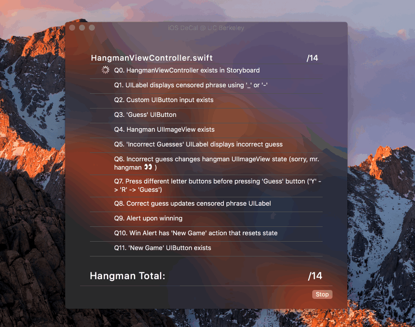

# HW2: Hangman #

## due ##
Monday, February 19th at 11:59pm (weekly OH will be announced this week)

## overview ##
In this project, you will be making an iOS application for the Hangman game. Users should be able to:
- start a game, 
- make guesses for a phrase (list of phrases provided), 
- see their progress toward the phrase, see a list of previously guessed incorrect letters, 
- see how many guesses they have left (indicated by a hangman image - basic images provided), 
- be alerted of a win or loss, and 
- start a new game.

Though we do not have many requirements for this project, you are encouraged to customize your app. Here's a screenshot from a past project submission for some inspiration:

## getting started ##
To submit, add your hw2 folder to a private repository. You can find detailed instructions on how to add your assignment to a repo [here](http://iosdecal.com/other_files/submission_instructions.pdf).
    
We have provided you code to interact with the list of locations in Berkeley (see **HangmanPhrases.swift**), but you will implement the rest of the features on your own. Add the following code to your code to generate a random  word (where you decide to add these lines is up to you!). 

    let hangmanPhrases = HangmanPhrases()
     
    // Generate a random phrase for the user to guess
    let phrase: String = hangmanPhrases.getRandomPhrase()
    print(phrase)

We've also provided some images for you to use in the **Assets.xcassets** folder (they're so boring though - you're encouraged to make your own!)

## requirements ##

### file requirements ###
You must create the following two files to pass the autograder (and to preserve MVC!). 
- **HangmanViewController.swift** - subclass of UIViewController
- **HangmanGame.swift** - model class for your game

### feature requirements
####  hangman game view ###
1. a `UILabel` that displays the "_"s corresponding to each word in the provided puzzle string
* a `UILabel` that lists the incorrect guesses thus far
* a `UITextField` (where the user enters a letter as a guess). Users should only be able to guess one letter at a time. **If you decide to create a custom keyboard, this is not required**
* a "Guess" `UIButton` that will update the game state based on the guessed letter
* if that letter appears in the puzzle string, the corresponding "_" should be replaced by the correctly guessed letter
* if that letter does not appear in the puzzle string, that letter should be added to the label from the second bullet point to keep track of "Incorrect Guesses: ", and the Hangman image should update to represent the number of incorrect guesses
* a `UIImageView` that represents the "state" of the Hangman, with appropriate images for each "state"

#### finished game states and starting a new game ###
- a win state alert [(example)](https://medium.com/ios-os-x-development/how-to-use-uialertcontroller-in-swift-70143d7fbede) with an action titled "New Game" that restarts the game _after_ being pressed.
- a game over state alert (no action requirement - feel free to do what you find best)
- a "Start Over" button in the main interface, which starts a new game

#### optional additions / features ###
* A smart way for the user to guess letters (since a TextField for letter entry isn't ideal UX).
* Customized design, including, but not limited to, custom images for the Hangman states
* Anything else that you think will impress us or you think would be fun to implement!

## grading and submission ##
If you complete all of the required features you will get full credit. We will deduct points for missing features, bugs, and UI layout issues. If you impress us with additional features (see the Optional Features section), you may be awarded an additional extra credit point.

### files to submit ####
- hw2 folder and contents
- a simulator screenshot of your app (on any orientation / device). Include this in your hw2 folder.

To submit, add your hw2 folder to a private repository (if you don't have free private repositories, get them here with the [github student developer pack](https://education.github.com/pack)). If you're new to GitHub, you can find detailed instructions on how to add your assignment to a repo [here](http://iosdecal.com/other_files/submission_instructions.pdf).

Using your private repository, submit your assignment to [Gradescope](https://www.gradescope.com). Please test that you uploaded correctly by downloading your submission, and testing that downloaded version in Xcode.

## 🔥 Autograder 🔥 ##

We're entering the pre-alpha release of our autograder. If you're willing, we would love for you to try it out! [It'll be released later this week](https://giphy.com/gifs/mrw-reddit-comment-tJeGZumxDB01q/fullscreen).
